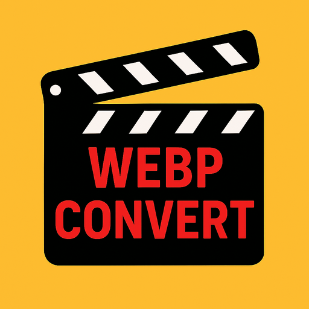

# VidToWebp

Turn a video into an animated WebP.

- Select one video from your gallery or files.
- Preview videos with automatic, looping playback.
- Trim, crop, rotate, and add text, stickers, or effects.
- Adjust resolution, frame rate (10–60 FPS), quality (50–100), and speed (1–3×).
- See the estimated file size as you adjust your options.
- Review options before each conversion and reuse your last settings.
- View the animated result and its actual file size.
- Save to your gallery or share the WebP.
- Receive a notification when conversion finishes.
